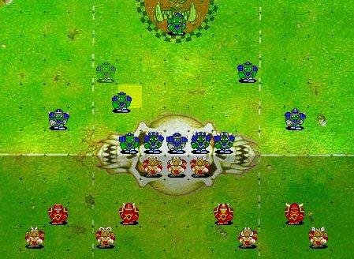
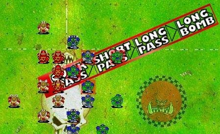
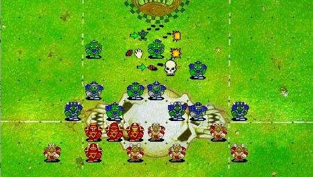

# BBArena
Java Open Source version of a fantasy football game, that allow roster creation, network play, match report generation and easy rules customization.

# Roadmap
## Done
- Modernize the model
- Add events and hooks
## Work In Progress
- Add LRB 6 rules
- Web interface
## To Do
- Add BB2 rules

# Build the project
Simply run
```
mvn clean install
```

# Test the project

Test the Crap Rules (Work In Progress)
```
mvn test -Dtest=TestCrap
```

# Run the server

Launch the web server with
```
mvn cargo:run
```
And connect with a browser with [http://localhost:8080/bbarena](http://localhost:8080/bbarena)

# Prototype
## Team SetUp

## Interception

## Action Ring

